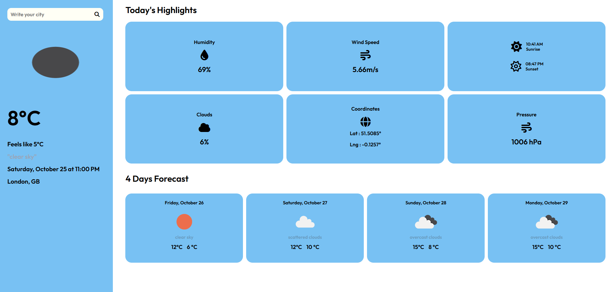

# Weather App 🌤️

A modern and user-friendly weather application that provides current weather conditions and a 4-day forecast for any city in the world.

## 🚀 Features

- ✅ Real-time weather data from OpenWeatherMap API
- ✅ Current weather conditions (temperature, humidity, wind speed)
- ✅ 4-day weather forecast
- ✅ Sunrise and sunset times
- ✅ Atmospheric pressure and cloud coverage
- ✅ "Feels like" temperature
- ✅ Responsive and modern UI
- ✅ Search any city worldwide

## 📸 Screenshot



## 🛠️ Technologies Used

- **Node.js** - Backend runtime
- **Express.js** - Web framework
- **EJS** - Template engine
- **Axios** - HTTP client for API requests
- **OpenWeatherMap API** - Weather data provider
- **dotenv** - Environment variable management

## 📦 Installation

1. Clone the repository:
```bash
git clone https://github.com/ibrahimmdef/weather-app.git
cd weather-app
```

2. Install dependencies:
```bash
npm install
```

3. Create a `.env` file in the root directory:
```bash
API_KEY="your_openweathermap_api_key_here"
```

4. Start the application:
```bash
node index.js
```

5. Open in your browser:
```
http://localhost:3000
```

## 📁 Project Structure

```
weather-app/
├── public/              # Static files (CSS, images, etc.)
├── views/
│   └── index.ejs       # Main page template
├── .env                # Environment variables (API key)
├── .gitignore          # Git ignore file
├── index.js            # Main application file
├── package.json        # Dependencies
└── README.md           # Project documentation
```

## 🎯 Usage

1. The app loads with London weather by default
2. Enter any city name in the search box
3. Click the search button or press Enter
4. View current weather and 4-day forecast
5. Weather data includes:
   - Current temperature and description
   - Feels like temperature
   - Humidity percentage
   - Wind speed
   - Sunrise and sunset times
   - Atmospheric pressure
   - Cloud coverage

## 🔑 Getting API Key

1. Visit [OpenWeatherMap](https://openweathermap.org/api)
2. Sign up for a free account
3. Generate your API key
4. Add it to your `.env` file

## 📝 Notes

- The app uses metric units (Celsius, mph)
- Weather forecast covers the next 4 days
- All times are displayed in 12-hour format
- API key is stored securely in `.env` file
- `.env` file is excluded from Git via `.gitignore`

## 🌍 API Information

This app uses the OpenWeatherMap API:
- Current Weather Data API
- 5 Day / 3 Hour Forecast API

## 👤 Author

**Ibrahim**
- GitHub: [@ibrahimmdef](https://github.com/ibrahimmdef)

## 📄 License

This project is licensed under the ISC License.

## ⭐ Support

If you like this project, don't forget to give it a star!

## 🤝 Contributing

Contributions, issues, and feature requests are welcome! Feel free to check the issues page.
